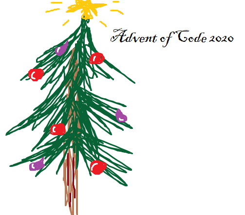

# Advent of Code 2020

Solving some [Advent of Code 2020](https://adventofcode.com/2020) problems with Elixir.

For fun only. Not trying to make the solutions super fast, or super pretty. There will be tests though.

## Notes

- Day 13, part 2: I was not able to solve this by myself. The code I have for this part is translated from this Rust implementation.
